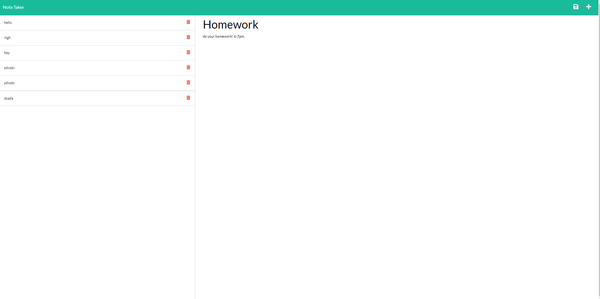
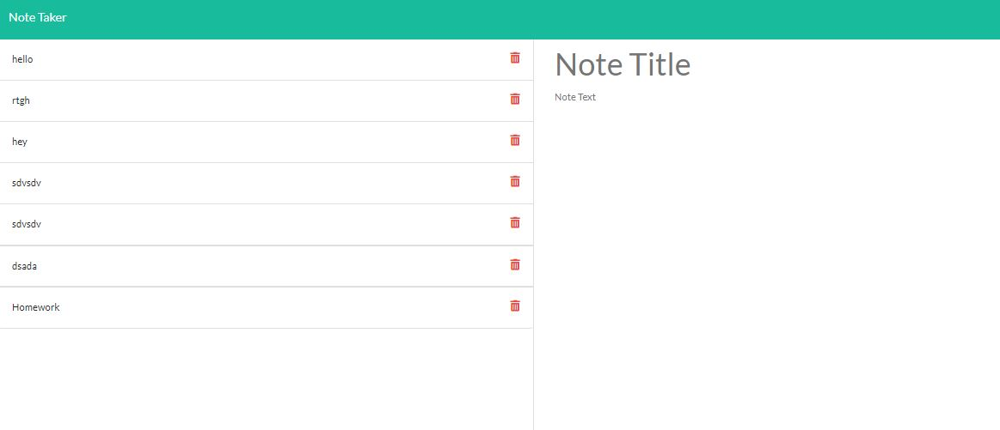

# Project Title
Note-Taker

## Description 
This application is for interactive users to write and save notes to their page.  

## Table of Contents
[Installation](#installation)
[Usage](#usage)
[Credits](#credits)
[License](#license)

## Installation 
Ran npm i for the dependencies, as well as npm i express for the application to handle routes. 

## Usage 
Use the application by clicking "get started" then entering a title and description for your note. If you chose to save, click the icon in the top right hand corner and it will save to the page.  

## Credits 
Express
© 2022 Trilogy Education Services, LLC, a 2U, Inc. brand. Confidential and Proprietary. All Rights Reserved.